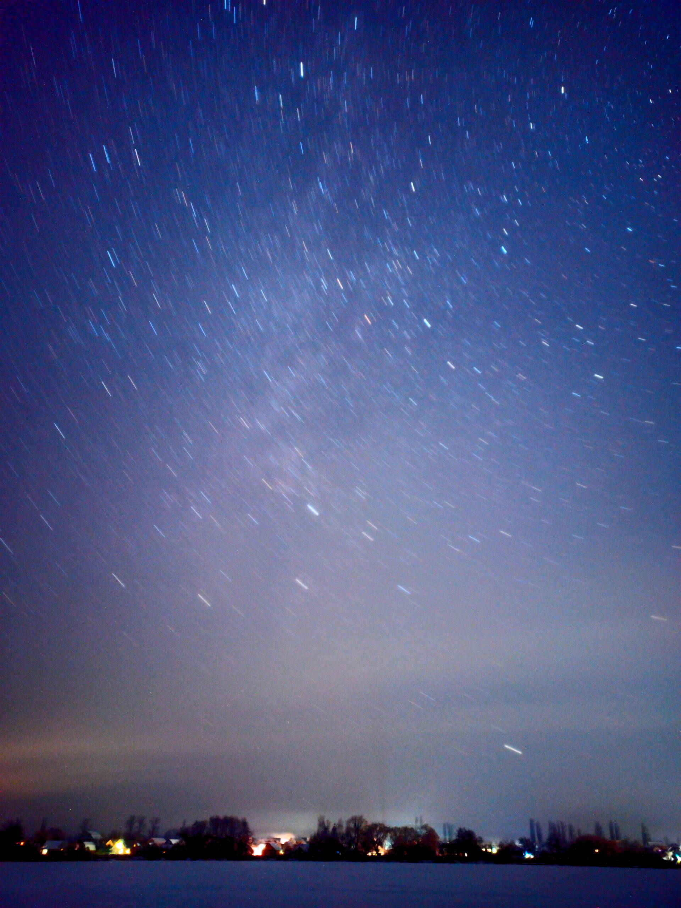
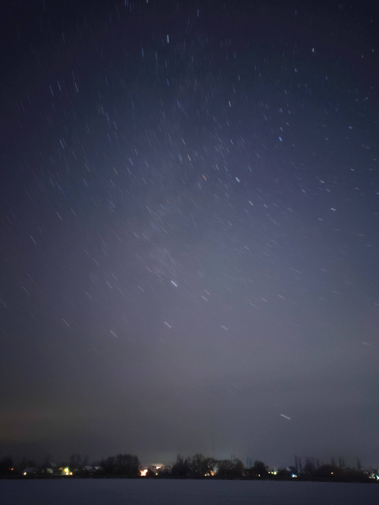
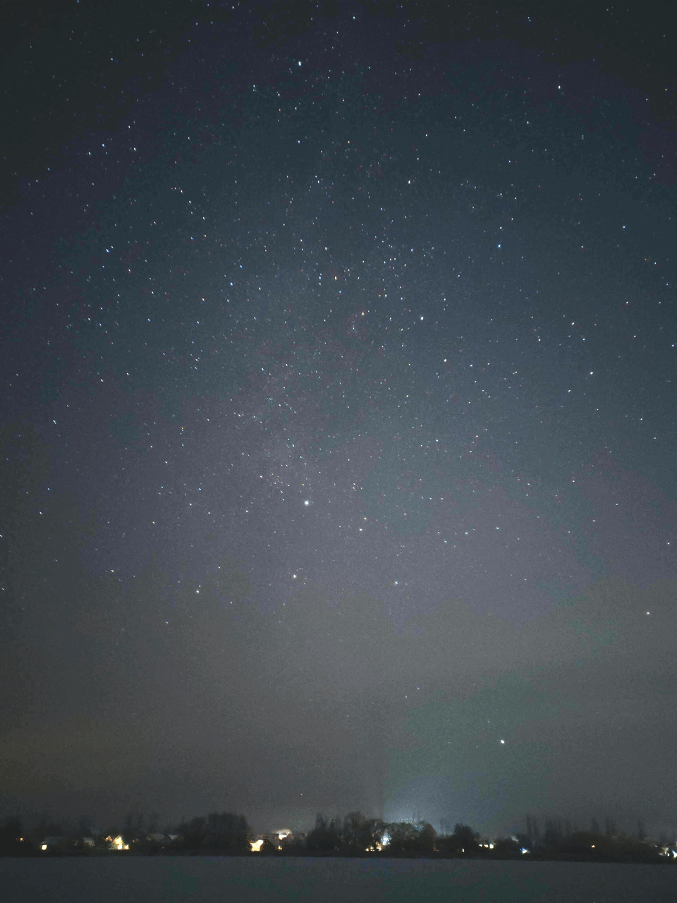

from full size dng:

from small jpg:

<!-- animation:
[animation](./photos/results/looped-anim-bright.mp4)
<video src="./photos/results/looped-anim-bright.mp4" controls></video>

animation webm:
[animation](./photos/results/looped-anim-bright.webm) -->

animation:

[TODO.txt - план работы](TODO.txt)
